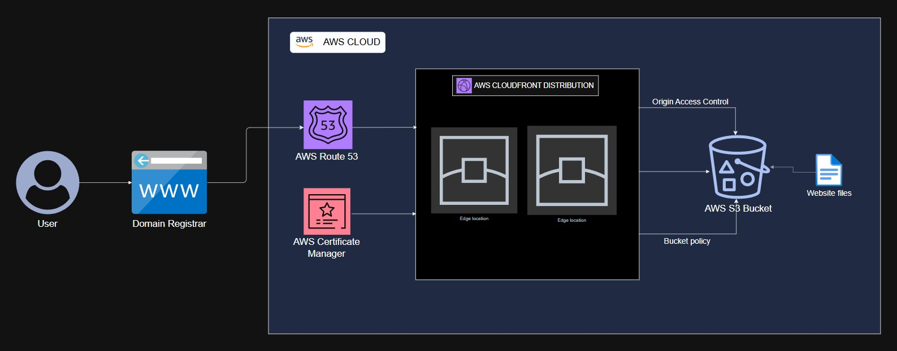

# Static Website Hosting with AWS S3, CloudFront and Route 53 — Terraform


A production-ready static website hosting infrastructure provisioned entirely with Terraform — combining a private S3 bucket, a CloudFront CDN distribution, Origin Access Control, and Route 53 DNS routing. Content is served globally at low latency over HTTPS, with the S3 bucket fully locked down from direct public access.




---

## Table of Contents

- [Static Website Hosting with AWS S3, CloudFront and Route 53 — Terraform](#static-website-hosting-with-aws-s3-cloudfront-and-route-53--terraform)
  - [Table of Contents](#table-of-contents)
  - [Learning Objectives](#learning-objectives)
  - [Project Overview](#project-overview)
  - [Architecture](#architecture)
  - [Technologies Used](#technologies-used)
  - [Features](#features)
  - [Project Structure](#project-structure)
  - [Prerequisites](#prerequisites)
  - [Deployment](#deployment)
    - [Part 1 — Prepare Your Domain and Variables](#part-1--prepare-your-domain-and-variables)
    - [Part 2 — Provision Infrastructure](#part-2--provision-infrastructure)
  - [Inputs](#inputs)
  - [Outputs](#outputs)
  - [Learnings \& Challenges](#learnings--challenges)
  - [References](#references)
  - [Contact](#contact)

---

## Learning Objectives

This project was built to demonstrate practical, hands-on experience in the following areas:

- Hosting a **static website on S3** with all public access blocked at the bucket level
- Configuring **CloudFront Origin Access Control (OAC)** to allow only CloudFront — and nothing else — to read from the S3 bucket
- Writing a **least-privilege S3 bucket policy** using `jsonencode()` that grants `s3:GetObject` exclusively to the CloudFront service principal
- Automatically uploading **website files to S3** with correct `content_type` per file extension using `fileset()` and `lookup()` terraform functions.
- Wiring **Route 53 DNS** to a CloudFront distribution using an alias A record
- Using **`locals`** to keep resource names and origin IDs consistent across the config without repetition

> **Note:** This is an infrastructure engineering project. The focus is on **cloud architecture, security configuration, and Terraform best practices** — not web development. The website files in `www/` exist solely to demonstrate a working deployment.

---

## Project Overview

In this project, CloudFront sits as the single public entry point in front of a private s3 bucket, serving content from edge locations around the world. Origin Access Control ensures that requests to S3 are signed and can only come from the specific CloudFront distribution — not from anyone with the bucket URL. Route 53 maps a custom domain name to the CloudFront distribution, so users reach the site via a clean domain rather than a raw CloudFront URL.

The entire stack — bucket, permissions, CDN, DNS — is defined as code and reproducible in a single `terraform apply`.

---

## Architecture

```
User types yourdomain.com in browser
            │
            ▼
    Route 53 (DNS)
    Resolves domain → CloudFront via Alias A record
            │
            ▼
  CloudFront Distribution
  - Global edge caching (PriceClass_100 — US, EU, Asia)
  - HTTPS enforced (redirect HTTP → HTTPS)
  - Default root object: index.html
  - Cache TTL: 0s min / 3600s default / 86400s max
            │
            │  Cache miss only — signed request via OAC
            ▼
  S3 Bucket (private — no public access)
  - Block all public ACLs and policies
  - OAC enforces CloudFront-only access
  - Bucket policy: Allow s3:GetObject from cloudfront.amazonaws.com
                   only if SourceArn matches this distribution
            │
            ▼
  Website files (uploaded by Terraform)
  index.html, CSS, JS, images — correct content_type per extension
```

---

## Technologies Used

| Technology | Role |
|------------|------|
| Terraform >= 1.0 | Infrastructure provisioning and state management |
| AWS S3 | Private static file storage and website content |
| AWS CloudFront | Global CDN — caching, HTTPS, edge delivery |
| AWS CloudFront OAC | Signed S3 access — restricts bucket to CloudFront only |
| AWS Route 53 | DNS hosting and domain-to-CloudFront alias routing |
| HashiCorp Local | `fileset()` used to upload website files dynamically |

---

## Features

| Feature | Detail |
|---------|--------|
| **Private S3 bucket** | All public access blocked — bucket is not directly reachable |
| **Origin Access Control** | Only the specific CloudFront distribution can read from S3 |
| **Least-privilege bucket policy** | `s3:GetObject` scoped to CloudFront service principal + SourceArn condition |
| **Automatic file upload** | `fileset()` uploads all files in `www/` with correct `content_type` per extension |
| **Global CDN** | CloudFront caches and serves content from edge locations in US, EU, and Asia |
| **HTTPS enforced** | `redirect-to-https` on all viewer requests |
| **Custom domain via Route 53** | Alias A record maps your domain to CloudFront — no CNAME limitations |
| **Consistent naming** | All resource names and IDs derived from `locals` |

---

## Project Structure

```
aws-cloudfront-s3-website/
│
├── main.tf              # S3, OAC, bucket policy, file upload, CloudFront, Route 53
├── variables.tf         # Input variable declarations
├── locals.tf            # Resource naming — bucket name, OAC name, origin ID
├── outputs.tf           # CloudFront domain, Route 53 zone ID, S3 bucket name
├── providers.tf         # AWS provider configuration
├── backend.tf           # Remote state backend (S3)
├── terraform.tfvars     # Variable values (not committed to version control)
└── www/                 # Website files to upload to S3
    ├── index.html
    ├── style.css
    └── ...
```

---


---

## Deployment

> ⚠️ **Cost Notice:** Resources provisioned by this project will incur AWS charges, including CloudFront data transfer and Route 53 hosted zone fees. Always run `terraform destroy` when the infrastructure is no longer needed.

### Prerequisites

Before deploying, ensure the following are in place:

- [Terraform >= 1.0](https://developer.hashicorp.com/terraform/install) installed locally
- AWS CLI installed and configured (`aws configure`) with permissions to manage S3, CloudFront, and Route 53
- **A registered domain name** — this project does not register domains. You need an existing domain either registered through Route 53 or a third-party registrar (Namecheap, GoDaddy, etc.)
- **If using a third-party registrar** — after `terraform apply` creates the Route 53 hosted zone, copy the NS records it outputs and update your registrar's nameservers to point to Route 53. DNS propagation can take up to 48 hours
- **Website files** — place your HTML, CSS, JS, and image files inside the `www/` folder before applying. Terraform uploads them automatically

> The Route 53 hosted zone **is created by Terraform** in this project. However, your domain registration must already exist — Terraform creates the zone but cannot purchase a domain.

### Deployment Steps
---
### Part 1 — Prepare Your Domain and Variables

**1. Place your website files** in the `www/` directory:

```
www/
├── index.html
├── style.css
└── images/
    └── logo.png
```

Terraform will automatically detect and upload all files with the correct `content_type`.

**2. Create a `terraform.tfvars` file** in the project root:

```hcl
project_name  = "mywebsite"
environment   = "production"
region        = "us-east-1"
route53_name  = "yourdomain.com"
record_name   = "yourdomain.com"

tags = {
  Owner = "your-name"
  Team  = "devops"
}
```

> `terraform.tfvars` should never be committed to version control.

---

### Part 2 — Provision Infrastructure

```bash
# Initialise Terraform and download providers
terraform init

# Preview what will be created
terraform plan

# Apply the configuration
terraform apply
```

Type `yes` when prompted. Terraform provisions resources in dependency order — S3 first, then OAC, then bucket policy, then CloudFront (which depends on both), then Route 53.

**After apply, verify the deployment:**

```bash
# Show all outputs
terraform output
```

**If you registered your domain outside AWS**, update your registrar's nameservers with the NS records from the Route 53 hosted zone:

```bash
# Get the nameservers assigned to your hosted zone
aws route53 list-resource-record-sets \
  --hosted-zone-id <your-zone-id> \
  --query "ResourceRecordSets[?Type=='NS'].ResourceRecords[].Value" \
  --output text
```

Copy those four nameserver values into your registrar's DNS settings. Once propagated, `yourdomain.com` will resolve to your CloudFront distribution.

**Test the site directly via CloudFront** (before DNS propagates):

```bash
curl https://<cloudfront-domain>.cloudfront.net
```

**Tear down all resources when done:**

```bash
terraform destroy
```

> ⚠️ `terraform destroy` will delete the S3 bucket and all its contents, the CloudFront distribution, and the Route 53 hosted zone. This is not reversible.

---

## Inputs

| Variable | Type | Default | Description |
|----------|------|---------|-------------|
| `project_name` | `string` | — | Project name used in resource naming |
| `environment` | `string` | — | Deployment environment (`dev`, `staging`, `production`) |
| `region` | `string` | — | AWS region for S3 and provider |
| `route53_name` | `string` | — | Domain name for the Route 53 hosted zone (e.g. `yourdomain.com`) |
| `record_name` | `string` | — | DNS record name to point at CloudFront (e.g. `yourdomain.com`) |
| `tags` | `map(string)` | `{}` | Additional tags applied to all resources |

---

## Outputs

| Output | Description |
|--------|-------------|
| `cloudfront_domain_name` | Auto-generated CloudFront URL (usable before DNS propagates) |
| `cloudfront_distribution_id` | CloudFront distribution ID (useful for cache invalidation) |
| `s3_bucket_name` | Name of the created S3 bucket |
| `route53_zone_id` | Hosted zone ID (needed for NS record updates at your registrar) |
| `route53_name_servers` | The four NS records to set at your domain registrar |

---

## Learnings & Challenges

### Understanding A Records vs Alias Records in Route 53
Pointing a custom domain to the CloudFront distribution turned out to be less straightforward than expected — CloudFront exposes a domain name, not an IP address, which made the choice of DNS record unclear. A CNAME seemed like the natural fit, but CNAMEs can't be used at the zone apex (the root domain), so that wasn't an option. Digging into how Route 53 handles this revealed that AWS extends the standard A record with an alias capability. Unlike a regular A record which maps to a raw IPv4 address, an alias A record maps directly to an AWS-managed resource — in this case the CloudFront distribution. It resolves entirely within AWS's internal DNS, works at the root domain, and doesn't incur extra Route 53 query charges. Once that clicked, the configuration made complete sense — and the takeaway is clear: whenever routing a domain to a CloudFront distribution in AWS, an alias A record is always the right tool, not a CNAME and not a standard A record.

### OAC vs OAI — why OAC is the right choice
CloudFront previously used Origin Access Identity (OAI) to restrict S3 access. OAC is the modern replacement. OAI used a special CloudFront user identity added to the bucket ACL — a less secure and less flexible approach. OAC uses IAM-style signed requests (SigV4), works with all S3 regions including new ones, and supports server-side encryption with AWS KMS. The bucket policy `SourceArn` condition in OAC also ties access to a specific distribution, not just any CloudFront distribution — a meaningful security improvement.


### Automatic file uploads with correct `content_type`
S3 doesn't infer `content_type` from file extensions — if you upload `index.html` without setting `content_type = "text/html"`, browsers receive it as `application/octet-stream` and prompt a download instead of rendering the page. The `lookup()` function maps each file's extension to the correct MIME type, with `application/octet-stream` as the fallback for unrecognised types. The extension is extracted using `split(".", each.value)` and taking the last element — handling files with multiple dots in their names correctly.


### Route 53 hosted zone created by Terraform — not a data lookup
Unlike many Terraform patterns where you look up an existing hosted zone with a `data` block, this config creates the hosted zone as a `resource`. This means the zone is managed by Terraform and will be destroyed on `terraform destroy`. The implication is that NS records at your registrar must be updated after the first apply, and re-checked if the infrastructure is ever torn down and redeployed — a new hosted zone gets new nameservers.

### CloudFront is eventually consistent
After `terraform apply` completes, CloudFront distributions take several minutes to fully deploy across all edge locations. The `terraform apply` will finish before the distribution is globally active. Testing immediately after apply may return errors — wait 5–10 minutes before testing the live URL.

---

## References

- [AWS CloudFront Origin Access Control](https://docs.aws.amazon.com/AmazonCloudFront/latest/DeveloperGuide/private-content-restricting-access-to-s3.html)
- [Terraform aws_cloudfront_distribution](https://registry.terraform.io/providers/hashicorp/aws/latest/docs/resources/cloudfront_distribution)
- [Terraform aws_cloudfront_origin_access_control](https://registry.terraform.io/providers/hashicorp/aws/latest/docs/resources/cloudfront_origin_access_control)
- [Terraform aws_s3_object with fileset](https://registry.terraform.io/providers/hashicorp/aws/latest/docs/resources/s3_object)
- [AWS Route 53 Alias Records](https://docs.aws.amazon.com/Route53/latest/DeveloperGuide/resource-record-sets-choosing-alias-non-alias.html)
- [CloudFront Price Classes](https://docs.aws.amazon.com/AmazonCloudFront/latest/DeveloperGuide/PriceClass.html)

---

## Contact

Let's connect!

[](https://www.linkedin.com/in/your-profile)