# Static Website Hosting with AWS S3, CloudFront and Route 53 — Terraform


A production-ready static website hosting infrastructure provisioned entirely with Terraform. It combines a private S3 bucket, a CloudFront CDN distribution, Origin Access Control, and Route 53 DNS routing. Content is served globally at low latency over HTTPS, with the S3 bucket fully locked down from direct public access.

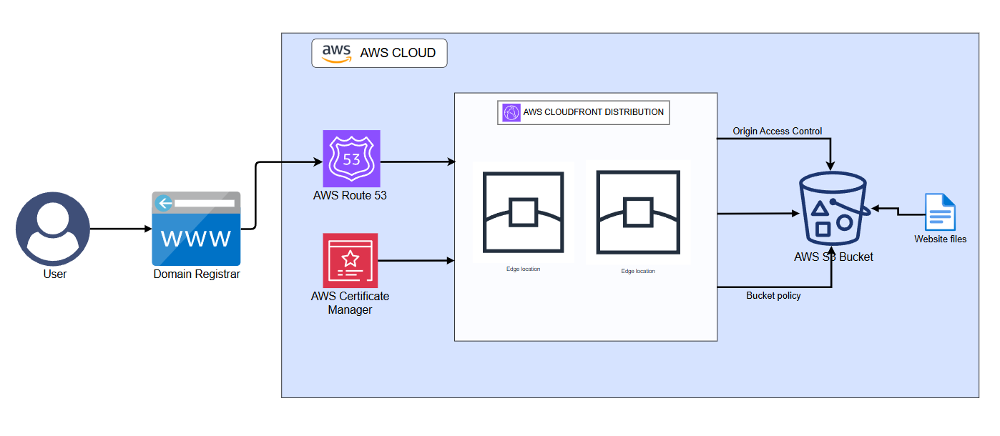


---

## Table of Contents

- [Static Website Hosting with AWS S3, CloudFront and Route 53 — Terraform](#static-website-hosting-with-aws-s3-cloudfront-and-route-53--terraform)
  - [Table of Contents](#table-of-contents)
  - [Learning Objectives](#learning-objectives)
  - [Project Overview](#project-overview)
  - [Architecture](#architecture)
  - [Technologies Used](#technologies-used)
  - [Features](#features)
  - [Project Structure](#project-structure)
  - [Deployment Result](#deployment-result)
  - [How to Deploy](#how-to-deploy)
    - [Prerequisites](#prerequisites)
    - [Deployment Steps](#deployment-steps)
  - [Inputs](#inputs)
  - [Outputs](#outputs)
  - [Learnings \& Challenges](#learnings--challenges)
  - [References](#references)
  - [Contact](#contact)

---

## Learning Objectives

This project was built to demonstrate practical, hands-on experience in the following areas:

- Hosting a **static website on S3** with all public access blocked at the bucket level
- Configuring **CloudFront Origin Access Control (OAC)** to allow only CloudFront — and nothing else — to read from the S3 bucket
- Writing a **least-privilege S3 bucket policy** using `jsonencode()` that grants `s3:GetObject` exclusively to the CloudFront service principal
- Automatically uploading **website files to S3** with correct `content_type` per file extension using `fileset()` and `lookup()` terraform functions.
- Connecting **Route 53 DNS** to a CloudFront distribution using an alias A record
- Using **`locals`** to keep resource names and origin IDs consistent across the config without repetition

> **Note:** This is an infrastructure as code project. The focus is on **cloud architecture, security configuration, and Terraform best practices** — not web development. The website files in `www/` exist solely to demonstrate a working deployment.


## Project Overview

In this project, CloudFront sits as the single public entry point in front of a private s3 bucket, serving content from edge locations around the world. Origin Access Control ensures that requests to S3 are signed and can only come from the specific CloudFront distribution. Route 53 maps a custom domain name to the CloudFront distribution, so users reach the site via a domain name rather than a raw CloudFront URL.

The entire stack (bucket, permissions, CDN, DNS) is defined as code and reproducible in a single `terraform apply`.


## Architecture

```
User types yourdomain.com in browser
            │
            ▼
    Domain Registrar
            │
            ▼
    Route 53 (DNS)
    Resolves domain → CloudFront via Alias A record
            │
            ▼
  CloudFront Distribution
            │  
            ▼
  S3 Bucket (private — no public access)
            │
            ▼
  Website files (uploaded by Terraform)

```


## Technologies Used

| Technology | Role |
|------------|------|
| Terraform >= 1.0 | Infrastructure provisioning and state management |
| AWS S3 | Private static file storage and website content |
| AWS CloudFront | Global CDN — caching, HTTPS, edge delivery |
| AWS CloudFront OAC | Signed S3 access — restricts bucket to CloudFront only |
| AWS Route 53 | DNS hosting and domain-to-CloudFront alias routing |


## Features

| Feature | Detail |
|---------|--------|
| **Remote State Locking** | Prevents multiple runs from modifying the same shared state file at the same time |
| **Private S3 bucket** | All public access blocked — bucket is not directly reachable |
| **Origin Access Control** | Only the specific CloudFront distribution can read from S3 |
| **Least-privilege bucket policy** | `s3:GetObject` scoped to CloudFront service principal + SourceArn condition |
| **Automatic file upload** | `fileset()` uploads all files in `www/` with correct `content_type` per extension |
| **Global CDN** | CloudFront caches and serves content from edge locations in US, EU, and Asia |
| **HTTPS enforced** | `redirect-to-https` on all viewer requests |
| **Custom domain via Route 53** | Alias A record maps your domain to CloudFront — no CNAME limitations |


## Project Structure

```
aws-cloudfront-s3-website/
│
├── main.tf              # S3, OAC, bucket policy, file upload, CloudFront, Route 53
├── variables.tf         # Input variable declarations
├── locals.tf            # Resource naming — bucket name, OAC name, origin ID
├── outputs.tf           # CloudFront domain, Route 53 zone ID, S3 bucket name
├── providers.tf         # AWS provider configuration
├── backend.tf           # Remote state backend (S3)
├── terraform.tfvars     # Variable values (not committed to version control)
└── www/                 # Website files to upload to S3
    ├── index.html
    ├── style.css
    └── ...
```


## Deployment Results

_**Output for `terraform plan`**_

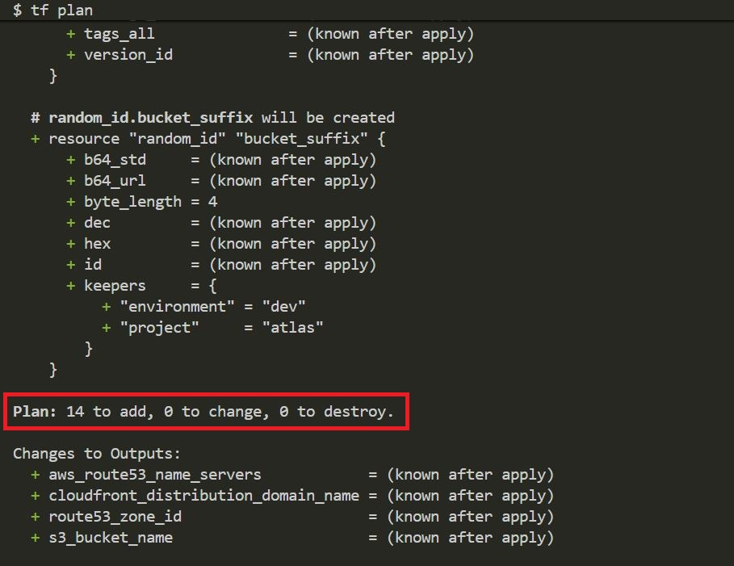

---

_**Output of `terraform apply`**_


**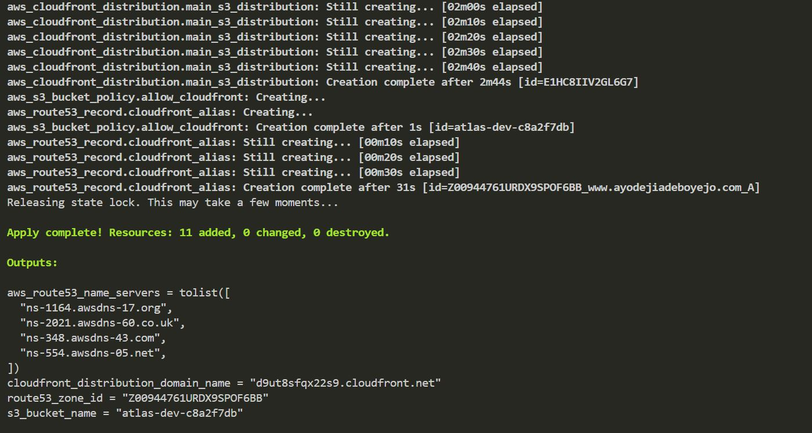**

---
_**CloudFront Distribution created in AWS**_

**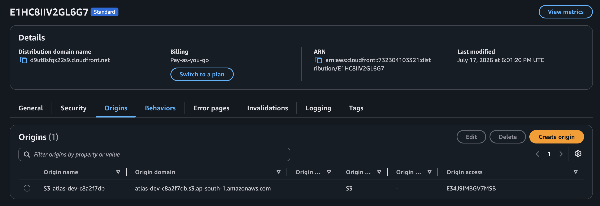**

---

_**ACM certificate in AWS**_

**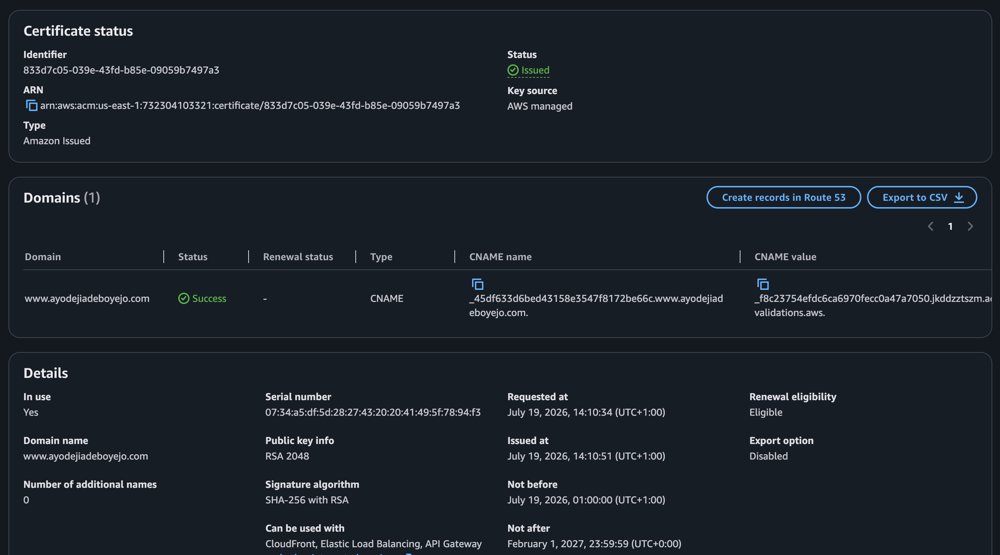**

--- 

_**S3 bucket created in AWS**_

**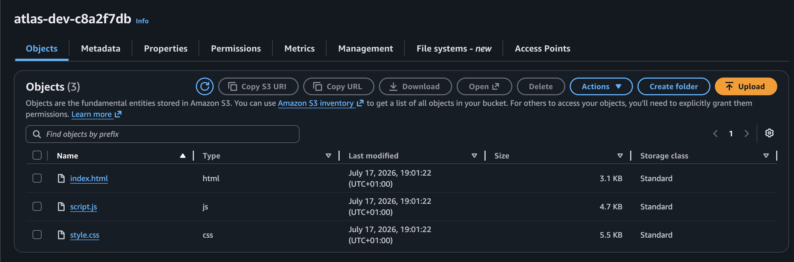**

--- 
_**Route53 Hosted Zone in AWS**_

****

--- 
_**Terraform Remote State file created in AWS**_

**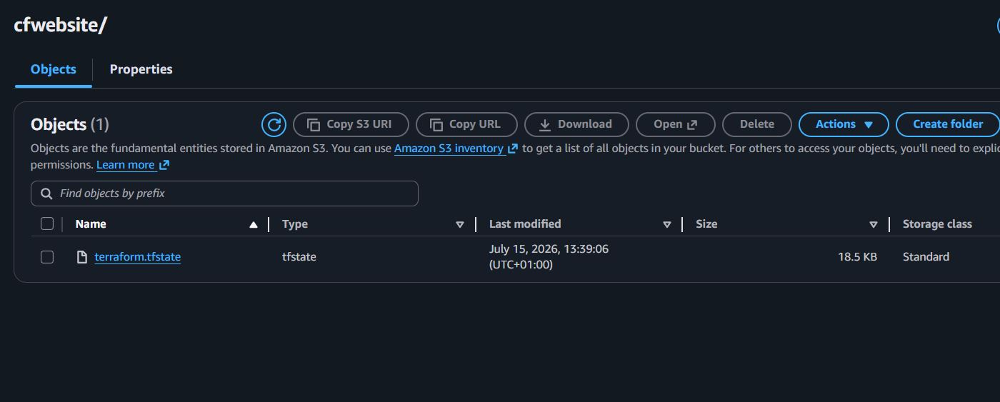**

--- 

_**Origin Access Control created in AWS**_

**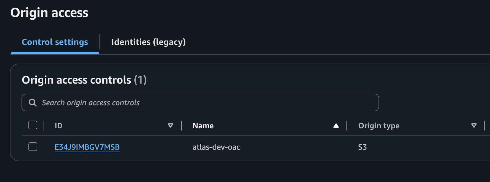**

---

_**Terraform Output**_

**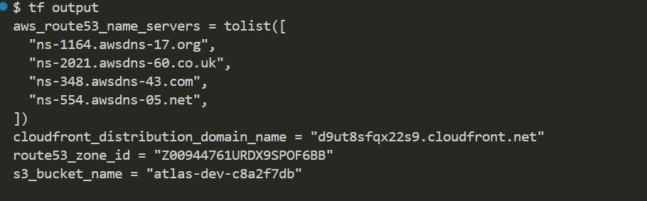**

---

_**Updating custom name servers on third-party domain registrar**_

**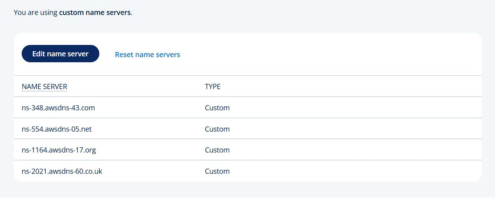**

_**Website displayed with TLS**_

**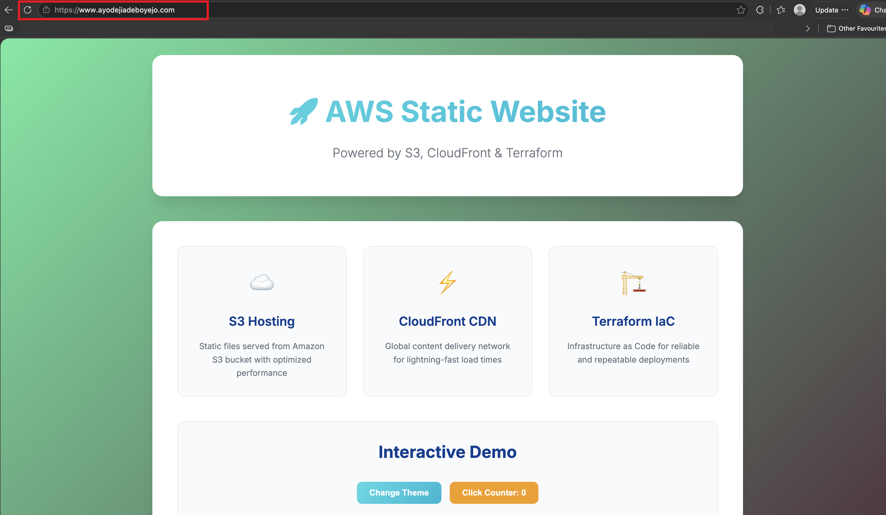**


## How to Deploy

> ⚠️ **Cost Notice:** Resources provisioned by this project will incur AWS charges, including CloudFront data transfer and Route 53 hosted zone fees. Always run `terraform destroy` when the infrastructure is no longer needed.

### Prerequisites

Before deploying, ensure the following are in place:

- [Terraform >= 1.0](https://developer.hashicorp.com/terraform/install) installed locally
- AWS CLI installed and configured (`aws configure`) with permissions to manage S3, CloudFront, and Route 53
- **A domain name registered with a third-party registrar** (Namecheap, GoDaddy, etc.)
- **Website files** — place your HTML, CSS, JS, and image files inside the `www/` folder before applying. Terraform uploads them automatically

---

### Part 1 — Prepare Your Variables and Website Files

**1. Place your website files** in the `www/` directory:

```
www/
├── index.html
├── style.css
└── images/
    └── logo.png
```

Terraform will automatically detect and upload all files with the correct `content_type`.

**2. Create a `terraform.tfvars` file** in the project root:

```hcl
project_name  = "your-project-name"
environment   = "your-environment"  # must be dev, staging or production
region        = "your-aws-region"
route53_name  = "yourdomain.com"
domain_name   = "www.yourdomain.com"
```

> `terraform.tfvars` should never be committed to version control.

---

### Part 2 — Provision Route 53

For this project, the domain is registered with a third-party registrar. When ACM creates an SSL certificate, it generates a unique CNAME record and writes it into the Route 53 hosted zone. To validate the certificate, ACM performs a public DNS query looking for that CNAME record. That query only reaches Route 53 if the domain's nameservers at the registrar are pointing to Route 53 — without this, ACM's query goes to the registrar's default nameservers which have no knowledge of the CNAME record, and the certificate stays in `PENDING_VALIDATION` indefinitely.

Deploying in two stages solves this. Stage 1 provisions only the Route 53 hosted zone and outputs its nameservers. The registrar's nameservers are then updated to point to Route 53. 

Once propagated, Stage 2 provisions the remaining resources — ACM creates the certificate, Terraform writes the CNAME validation record into Route 53, ACM's DNS query reaches Route 53, finds the record, and the certificate is issued.


**Stage 1 — provision the Route 53 hosted zone first:**

```bash
# Initialise Terraform and download providers
terraform init

# Check for errors in the HCL
terraform validate

# Provision only the Route 53 hosted zone
terraform apply -target=aws_route53_zone.main_route
```

Retrieve the nameservers assigned to the hosted zone:

```bash
terraform output route53_nameservers
```

You will see four values like:

```
ns-123.awsdns-45.com
ns-678.awsdns-90.net
ns-111.awsdns-22.co.uk
ns-999.awsdns-00.org
```

Log in to your domain registrar and replace the existing nameservers with these four values.

Verify propagation before proceeding — this can take between 5 minutes and 48 hours:

```bash
nslookup -type=NS yourdomain.com
```

When the command returns the Route 53 nameservers, propagation is complete and you can proceed to Stage 2.

---

### Part 3 — Provision the Remaining Infrastructure

Once DNS has propagated, apply the full configuration:

```bash
# Preview what will be created
terraform plan

# Apply the remaining configuration
terraform apply
```

Type `yes` when prompted. Terraform provisions the remaining resources in dependency order — S3 bucket, OAC, bucket policy, ACM certificate, DNS validation record, CloudFront distribution, and Route 53 alias record. The apply will wait for the ACM certificate to reach `ISSUED` status before attaching it to CloudFront.

---

### Part 4 — Verify

After apply completes, check the outputs:

```bash
terraform output
```

Test the site directly via CloudFront before DNS fully propagates:

```bash
curl https://<cloudfront-domain>.cloudfront.net
```

Or visit the `cloudfront_distribution_domain_name` value from your terraform output in a browser.

Once DNS has propagated, your site will be accessible at `https://www.yourdomain.com`.

---

### Tear down

```bash
terraform destroy
```

> ⚠️ `terraform destroy` will delete the S3 bucket and all its contents, the CloudFront distribution, and the Route 53 hosted zone. This is not reversible.

## Inputs

| Variable | Type | Default | Description |
|----------|------|---------|-------------|
| `project_name` | `string` | — | Project name used in resource naming |
| `environment` | `string` | — | Deployment environment (`dev`, `staging`, `production`) |
| `region` | `string` | — | AWS region for S3 and provider |
| `route53_name` | `string` | — | Domain name for the Route 53 hosted zone (e.g. `yourdomain.com`) |
| `domain_name` | `string` | — | DNS domain name to point at CloudFront (e.g. `www.yourdomain.com`) |
| `tags` | `map(string)` | `{}` | Additional tags applied to all resources |

---

## Outputs

| Output | Description |
|--------|-------------|
| `cloudfront_domain_name` | Auto-generated CloudFront URL (usable before DNS propagates) |
| `cloudfront_distribution_id` | CloudFront distribution ID (useful for cache invalidation) |
| `s3_bucket_name` | Name of the created S3 bucket |
| `route53_zone_id` | Hosted zone ID (needed for NS record updates at your registrar) |
| `route53_name_servers` | The four NS records to set at your domain registrar |

---

## Learnings & Challenges

### CloudFront 403 error with custom domain
At the initial deployment, the CloudFront domain worked correctly but the custom domain returned a 403 error. The root cause was that CloudFront only responds to requests for domain names explicitly listed in its `aliases` configuration. Any other request arriving from an unlisted domain is rejected with 403 before it even reaches the origin. This was caused by two missing configurations: the `aliases` block on the distribution telling CloudFront to accept requests for the custom domain, and an ACM certificate to handle HTTPS for that domain. The fix was to request an ACM certificate, attach it to the distribution via the `viewer_certificate` block, and add the custom domain to the `aliases` block of the distribution.

### Two-stage deployment — ACM certificate validation with a third-party domain

When ACM creates an SSL certificate, it generates a unique CNAME record and writes it into the Route 53 hosted zone. To validate the certificate, ACM performs a public DNS query for that CNAME record — but that query only reaches Route 53 if the domain's nameservers at the registrar are pointing to Route 53. Without this, ACM queries the registrar's default nameservers which have no knowledge of the CNAME record, and the certificate stays in `PENDING_VALIDATION` indefinitely, causing `terraform apply` to hang.

The fix was to split the deployment into two stages — first provision the Route 53 hosted zone, update the registrar's nameservers to point to Route 53, confirm propagation, then run the full `terraform apply`. This ensures both conditions required for validation are satisfied before ACM requests the certificate: the CNAME record exists in Route 53 and the domain is pointing to Route 53 nameservers.


### Alias A record vs CNAME for CloudFront

Pointing a custom domain to CloudFront was less straightforward than expected. CloudFront exposes a domain name, not an IP address, which made the DNS record choice unclear. A CNAME seemed like the natural fit until I discovered that CNAMEs cannot be used at the zone apex — the root domain. Route 53 solves this with an alias A record, which unlike a standard A record, maps directly to an AWS resource rather than a raw IP address. It works at the root domain, resolves within AWS's internal DNS, and carries no extra Route 53 query charges. The takeaway — whenever routing a domain to a CloudFront distribution, an alias A record is always the right choice.

### OAC vs OAI — why OAC is the right choice
CloudFront previously used Origin Access Identity (OAI) to restrict S3 access. OAC is the modern replacement. OAI used a special CloudFront user identity added to the bucket ACL — a less secure and less flexible approach. OAC uses IAM-style signed requests (SigV4), works with all S3 regions including new ones, and supports server-side encryption with AWS KMS. The bucket policy `SourceArn` condition in OAC also ties access to a specific distribution, not just any CloudFront distribution — a meaningful security improvement.


## References

- [AWS CloudFront Origin Access Control](https://docs.aws.amazon.com/AmazonCloudFront/latest/DeveloperGuide/private-content-restricting-access-to-s3.html)
- [Terraform aws_cloudfront_distribution](https://registry.terraform.io/providers/hashicorp/aws/latest/docs/resources/cloudfront_distribution)
- [Terraform aws_cloudfront_origin_access_control](https://registry.terraform.io/providers/hashicorp/aws/latest/docs/resources/cloudfront_origin_access_control)
- [Terraform aws_s3_object with fileset](https://registry.terraform.io/providers/hashicorp/aws/latest/docs/resources/s3_object)
- [AWS Route 53 Alias Records](https://docs.aws.amazon.com/Route53/latest/DeveloperGuide/resource-record-sets-choosing-alias-non-alias.html)
- [CloudFront Price Classes](https://docs.aws.amazon.com/AmazonCloudFront/latest/DeveloperGuide/PriceClass.html)

---

## Contact

Let's connect!

[](https://www.linkedin.com/in/ayodejiadeboyejo/)